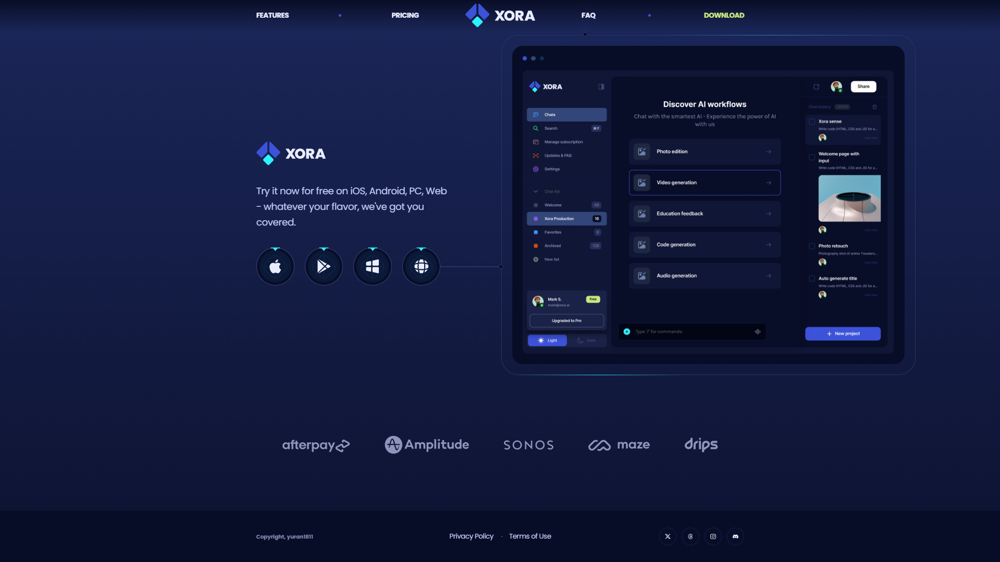

<h1 align="center">XORA - SaaS Landing Page</h1>
<p align="center">
  
</p>

<p align="center">
  
  
  
  
</p>

<div align="center"><a href="https://saas-landing-page-xora-kappa.vercel.app/" target="_blank">Live Demo</a></div>

## Introduction

- Xora is a Modern UI/UX SaaS website developed using React.js and Tailwind CSS that exemplifies modern UI/UX principles. Its sleek design, seamless animations, and overall user experience set a high standard, serving as a reference or inspiration for future modern applications or websites in general.

## Features

- Stunning Sections: Includes hero, features, pricing (monthly/yearly), FAQ, testimonials, and download software sections.
- Smooth Animations: Complex CSS for fluid animations and eye-catching effects.
- Cool CSS Gradients: Beautiful gradient effects using CSS before and after pseudo-elements.
- Seamless Navigation: Offers a smooth user experience with intuitive navigation and scrolling.
- Optimized Performance: Built for fast loading and an optimized experience.
- Pixel Perfect Design: Ensures flawless responsiveness across all devices and screen sizes.

and many more, including code architecture and reusability

## Tech Stack


- UI libs: react-scroll, react-countup, react-slidedown

## Screenshots

<div style="display:flex;flex-wrap:wrap;gap:12px;justify-content:center">
    
    
    
    
    
    
</div>

## Quick Start

Follow these steps to set up the project locally on your machine.

**Prerequisites**

Make sure you have the following installed on your machine:

- [Git](https://git-scm.com/)
- [Node.js](https://nodejs.org/en)

**Cloning the Repository**

```bash
git clone https://github.com/yuran1811/saas-landing-page-xora.git
cd saas-landing-page-xora
```

**Installation**

Install the project dependencies:

```bash
npm install
```

or

```bash
yarn
```

**Running the Project**

```bash
npm run dev
```

or

```bash
yarn dev
```

Open [http://localhost:5173](http://localhost:5173) in your browser to view the project.

## References

- [Origin project](https://github.com/adrianhajdin/xora) from JSMastery
